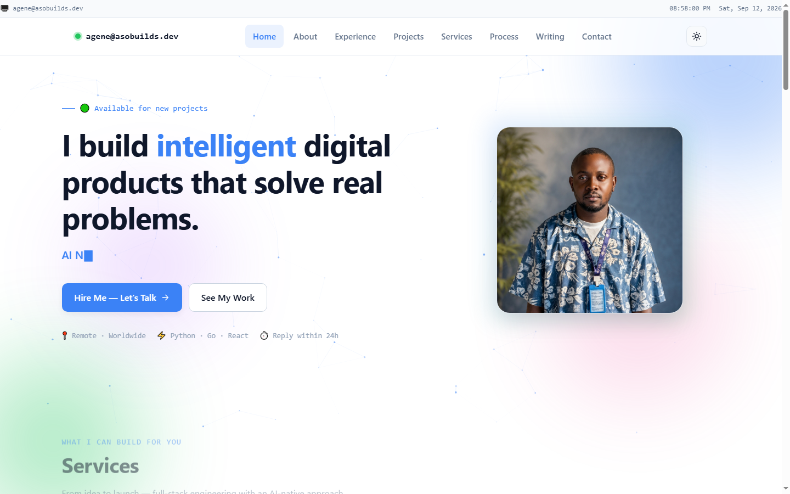

# Agene S. Okoh — Portfolio

> **AI-Native Full Stack Developer** · Python · Go · React

[](https://agene-okoh.vercel.app)
[](https://vercel.com)
[](https://opensource.org/licenses/MIT)

A portfolio that doubles as its own case study — multi-page ecosystem with blog, project case studies, interactive terminal, working contact funnel, and SEO infrastructure.

**Live:** [agene-okoh.vercel.app](https://agene-okoh.vercel.app)

---

## 📸 Preview



---

## What's here

- **6 project case studies** — DevCraft Career, NativityGuard, Plant Assistant, LeadClear Journal, My Creative Partner, and this portfolio itself
- **9 blog posts** — build logs, engineering essays, research notes
- **Working contact funnel** — Formspree form + direct links (email, WhatsApp, LinkedIn, GitHub, X)
- **Client-side search** — Fuse.js, indexes both posts and projects
- **Reading experience** — estimated reading time, progress bar, sticky table of contents
- **Comments** — Giscus (GitHub Discussions) on every post
- **Newsletter signup** — Buttondown
- **RSS feed** — [feed.xml](feed.xml)
- **Dark mode** — persists across pages
- **Terminal overlay** — `Ctrl + \``, 10+ commands
- **SEO** — sitemap, robots, OpenGraph tags, Google Search Console verified
- **Analytics** — Vercel Analytics (privacy-respecting)

---

## Tech Stack

Deliberately no framework. No build step. Static HTML, CSS, and JavaScript — fast by default, cheap to host, easy to read.

| Layer | Choice |
|-------|--------|
| Markup | Semantic HTML5 |
| Styling | Single stylesheet with CSS variables (design system), dark mode, responsive breakpoints |
| Scripting | Vanilla JS (chrome injection, particles, terminal, reading time, TOC) |
| Search | [Fuse.js](https://fusejs.io/) |
| Comments | [Giscus](https://giscus.app/) (GitHub Discussions) |
| Forms | [Formspree](https://formspree.io/) |
| Newsletter | [Buttondown](https://buttondown.com/) |
| Hosting | [Vercel](https://vercel.com/) |
| Analytics | [Vercel Analytics](https://vercel.com/analytics) |

---

## Project Structure

```
my-portfolio/
├── index.html          # Homepage
├── about.html          # Bio + résumé embed
├── experience.html     # Timeline + skills
├── projects.html       # Project index
├── services.html       # Service offering
├── process.html        # How I work
├── contact.html        # Contact + Formspree
├── resume.html         # Printable résumé
├── 404.html
│
├── blog/
│   ├── index.html      # Post index + newsletter
│   ├── search.html     # Client-side search
│   ├── search-index.json # Fuse.js index
│   └── *.html          # Individual posts
│
├── projects/           # Per-project case studies
│   └── *.html
│
├── assets/
│   ├── css/style.css   # Design system + all styles
│   ├── js/script.js    # All JS
│   ├── images/         # Profile, screenshots, mockups
│   └── documents/      # Résumé PDF
│
├── feed.xml            # RSS 2.0
├── sitemap.xml         # 20+ URLs
├── robots.txt
├── vercel.json         # Clean URLs, security headers, redirects
└── README.md
```

---

## Local Development

No build tools, no dependencies. Just open the files.

**Option 1 — Direct:**
```bash
open index.html        # macOS
start index.html       # Windows
```

**Option 2 — Local server (recommended, matches production paths):**
```bash
python -m http.server 8000
# then visit http://localhost:8000
```

---

## Deployment

Deployed to Vercel. Every git push to main can be wired to auto-deploy (Vercel Git Integration), or manually via CLI:

```bash
vercel --prod
```

---

## Redirects

Old URLs from before the NativityGuard rebrand are 301-redirected:

| Old | New |
|-----|-----|
| /projects/communityshield | /projects/nativityguard |
| /blog/building-communityshield | /blog/building-nativityguard |

---

## Security Headers

Set in `vercel.json`: `X-Content-Type-Options`, `X-Frame-Options`, `Referrer-Policy`, `Permissions-Policy`. Cache rules: 60s for CSS/JS, 1 year immutable for images.

---

## Health Check

Before every deploy, a PowerShell script validates that no critical file has been corrupted:

```powershell
.\health-check.ps1
```

Run it. If it says ✅ ALL CLEAR — safe to deploy, ship. If it flags anything, fix it first.

---

## About Me

I'm a philosopher-turned-engineer building AI-native web applications with Python, Go, and React. Most of my work sits at the intersection of full-stack engineering and AI-for-good — civic tech, agri-tech, and dev tools.

I'm open to full-time roles, freelance projects, and collaborations on civic tech or AI-for-good work.

📬 agenesunday143@gmail.com · WhatsApp · LinkedIn · GitHub · X

---

## License

MIT — feel free to learn from the structure. Please don't copy the content (bio, project descriptions, essays) verbatim.